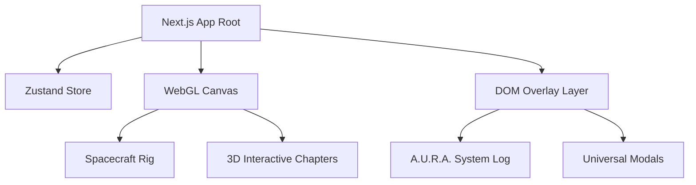

# Technical Architecture: Project Odyssey
**Framework:** Next.js 16 (App Router, Turbopack)  
**3D Engine:** React Three Fiber (R3F), Three.js, Drei  
**State Management:** Zustand  
**Styling:** Tailwind CSS, Framer Motion  

---

## 1. Rendering Pipeline & Layout
The application runs on a single canvas covering 100% of the viewport. Elements are structured in two distinct layers:
1. **WebGL Canvas Layer (Background):** Renders stars, spacecraft, planets, and interactive stations.
2. **HTML DOM Overlay Layer (Foreground):** Renders cockpit telemetry, A.U.R.A. flight logs, buttons, and modals.

## 2. Telemetry and Scroll Synchronization
The scroll progress of the viewport (0.0 to 1.0) is monitored inside an R3F `useScroll` context. This progress is synchronized with the Zustand state to update the current chapter, trigger haptics, and update A.U.R.A.'s telemetry text.
